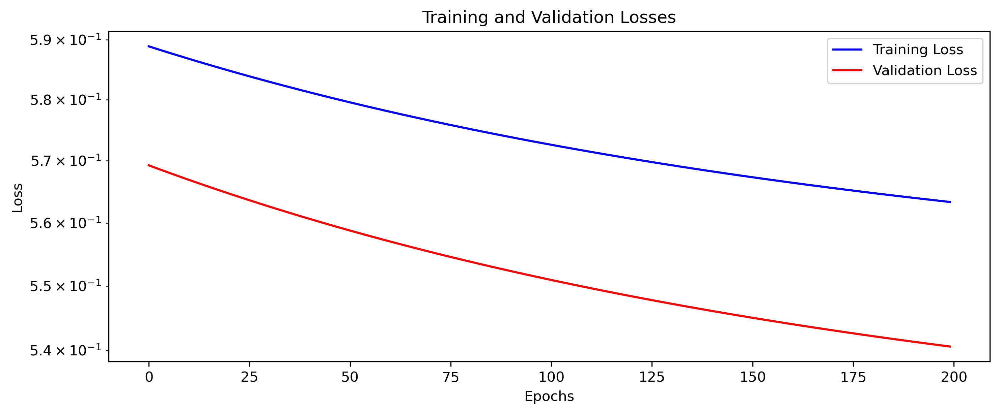

# 🎓 Model Card – Binary Classification Project

*Professor:* *[Ivanovitch Medieros Dantas da Silva](https://github.com/ivanovitchm)* 

*Student: [Luiz Eduardo Nunes Cho-Luck](https://github.com/eduardocholuck) - 20241012311*

## Overview

This project aims to predict admission outcomes based on features such as GPA, GMAT score, work experience and others. The model was developed for the ***Project #01 for PPGEEC2318 - Machine Learning.***

## Model

- **Model Type**: Binary classifier  
- **Framework**: PyTorch  
- **Architecture**: Multilayer Perceptron (MLP)  
- **Loss Function**: Binary Cross Entropy  
- **Optimizer**: Adam  
- **Validation Strategy**: Training/validation split using `train_test_split`

## Technologies Used

- Python
- PyTorch
- Scikit-learn
- Pandas
- NumPy
- Matplotlib

## Dataset

- **Original Source**: The original dataset was obtained from the following repository: [KatePril/admission-prediction](https://github.com/KatePril/admission-prediction/tree/main/dataset). 
- **Original Size**: 6,194 entries  
- **Original Features**:
  - `application_id`, `gender`, `international`, `gpa`, `major`, `race`, `gmat`, `work_exp`, `work_industry`, `admission`

### Feature Engineering and Cleaning

The following preprocessing steps were applied to prepare the dataset for model training:

- **Admission Label**:
  - Merged `Waitlist` and `Admit` as a single positive class.
  - Encoded `admission` as binary: `Admit/Waitlist` → `1`, others → `0`.

- **Missing Values**:
  - Replaced missing values in the `race` column with `'Unknown'`.

- **Categorical Encoding**:
  - `race`: Mapped to integers from 0 to 5 (e.g., `Other`: 0, `White`: 4, `Unknown`: 5).
  - `gender`: Encoded as `0` (Male) and `1` (Female).
  - `work_industry`: Mapped to integers from 0 to 13 based on category (e.g., `CPG`: 0, `Technology`: 13).

- **Class Balancing**:
  - Performed *under-sampling* of the majority class (`admission == 0`) to match the number of positive samples, resulting in a balanced dataset.

- **Final Size**: 2000 samples after class balancing.


## Training

The model was trained using a simple neural network built with PyTorch. The main training steps include:

- **Architecture**: A fully connected feedforward neural network (Multilayer Perceptron).
- **Input Features**: Normalized versions of `gpa`, `gmat`, `work_exp`, and encoded categorical variables.
- **Loss Function**: Binary Cross Entropy Loss (`nn.BCELoss`)
- **Optimizer**: Adam optimizer with a learning rate of 0.001
- **Batch Size**: 16
- **Epochs**: 200
- **Validation Strategy**: 80/20 train-validation split using `train_test_split`

During training, loss values were monitored across epochs for traing and validation, as you can see below and a confusion matrix was computed to evaluate model performance. 



## Metrics

The following evaluation metrics were used:

- Accuracy  
- Precision  
- Recall
- F1-Score


## Results

Coonfusion Matrix:

](images/CM.png)


## Evaluation Metrics

| Metric     | Value   |
|------------|---------|
| Accuracy   | 0.7575  |
| Precision  | 0.7452  |
| Recall     | 0.7789  |
| F1-Score   | 0.7617  |


* The model achieves 75.8% accuracy, indicating solid overall performance on predicting MBA admissions.

* With a recall of 77.9%, it effectively identifies most admitted candidates, minimizing false negatives.

* A precision of 74.5% and F1-score of 76.2% reflect a good balance between correctness and completeness in its positive predictions.

## Model Saving

The trained model is saved in `.pth` format using:

```python
torch.save(model.state_dict(), "mba_model.pth")
```

## Final Remarks

This model is a proof of concept developed for academic purposes. Although it shows promising results, it is not recommended for production use without further generalization and fairness assessments.

For more details, please see this [notebook](model_train.ipynb).

Special thanks to the original dataset contributors and Luísa Christina de Souza that helped me with the project.